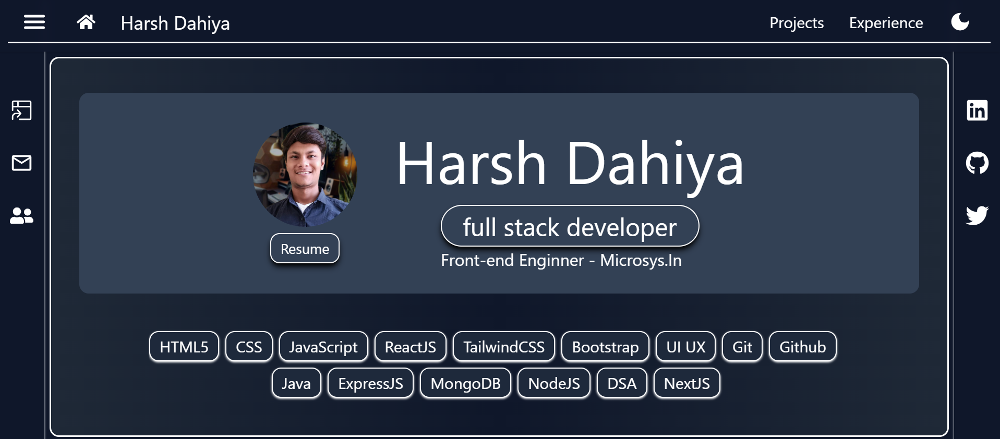

<h1 align ="center">Harsh Dahiya - Porfolio</h1>

Welcome to my Portfolio Website - HarshDahiya's PortFolio

You can also check out the live demo of the website at [here](https://harshdahiya.vercel.app/).

## Technologies Used

- **React**: A popular JavaScript library for building user interfaces. It provides a dynamic and efficient way to create interactive components.

- **Tailwind CSS**: A utility-first CSS framework that makes styling and designing your app a breeze. Customize the app's appearance with ease.

- **Vercel.com**: Vercel.com for deploying the site and make it live for you.

## Getting Started

- Fork the repository on GitHub.
- Clone your forked repository locally: `git@github.com:believeharsh/PortFolio.git`
- Change your directory to the project: `cd <project name>`
- Install project dependencies: `npm install`
- Run in server: `npm run dev`

## Happy learning ~ 
